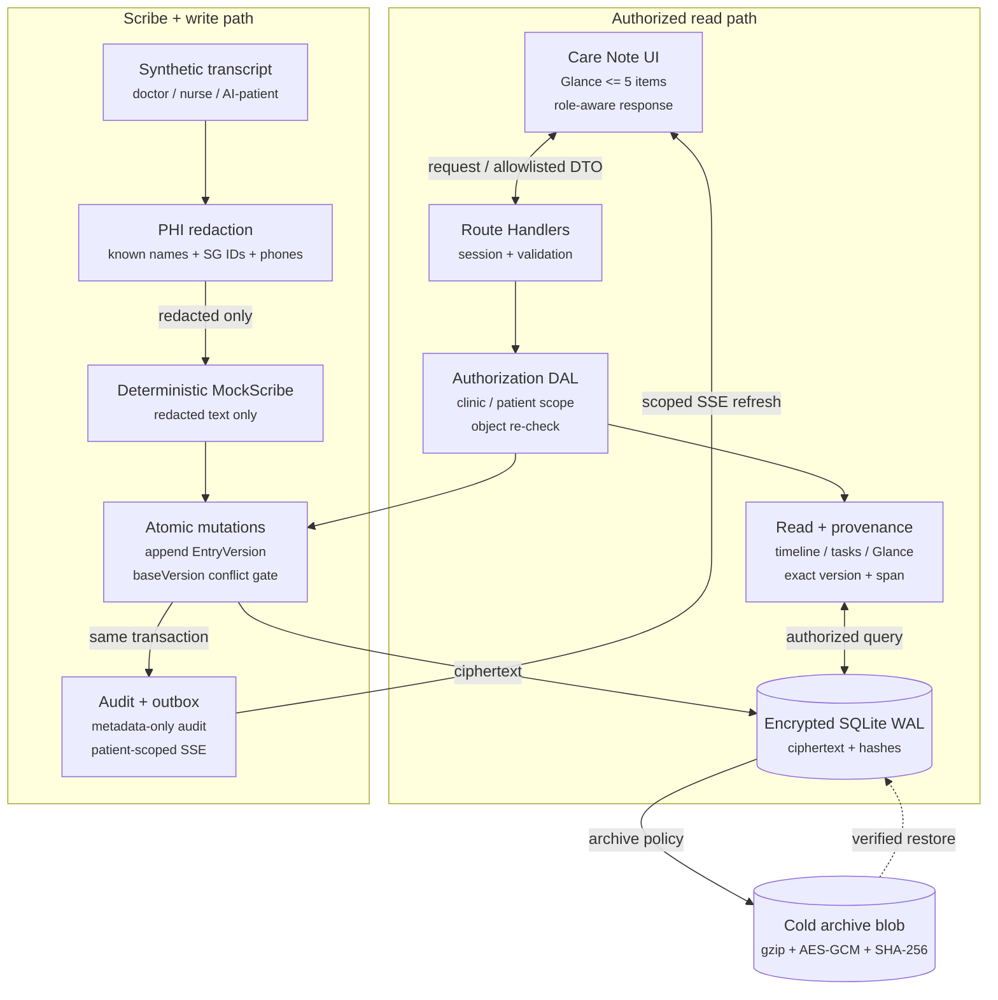
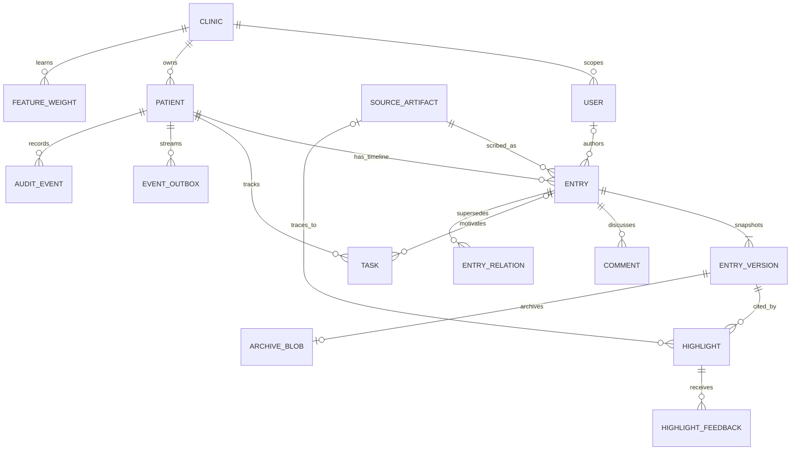

# Nightingale Shared Care Note

## 1. What I built and why

During a consult, the expensive task is not writing another note. It is finding what changed, what is still open, and whether a claim can be trusted. I kept the longitudinal timeline as the record of fact and made Glance a five-item working set. It favors risk, unfinished work, clinician-confirmed corrections, and recent change. Each item says why it is shown and opens the exact stored source span.

The 72-hour build covers role-owned entries, comments and assignments, tasks, full revision snapshots, append-only revert, deterministic conflicts, patient-safe instructions and patient-authored updates, three synthetic scribe interaction types, exact provenance, reversible feedback-based re-ranking, connection-aware SSE, admin audit review, and verified cold archive. I left out voice capture, transcription, diarization, a real model provider, EHR integration, and any claim that this prototype is ready for real patient data.

One TypeScript repository contains the Next.js 16.3.2 UI, Route Handlers, SSE endpoint, and server data-access layer. Prisma 7.9.1 uses the better-sqlite3 adapter against one local SQLite WAL database.

The core assumption is a synthetic, single-region clinic demo with seeded identities and stable loopback connectivity. The first-principles rule is that a useful summary must never become a second source of truth: authorization is enforced on the server, writes are append-only, and every derived claim must resolve to immutable evidence.

### System architecture



Route Handlers authenticate an opaque demo cookie and validate input. The data-access layer then checks clinic or patient scope again before reading the object. A successful write appends an encrypted `EntryVersion`; an atomic `currentVersion == baseVersion` update decides whether it succeeds. Audit metadata and the outbox event are written in the same transaction.

The scribe path is local and deterministic. `runMockScribe` redacts known patient names, Singapore ID patterns, and phone patterns before its summary logic runs. No provider or network call exists in the demo. The raw synthetic transcript, redacted copy, summary, reason text, and note content are stored as AES-256-GCM ciphertext.

Clinical narrative fields are encrypted, but identifiers and control metadata are not. That is one reason this build remains synthetic-data only. The redactor is also a narrow pattern matcher, not a production DLP system.

## 2. Data model and trust mechanics



`Entry` holds ownership, role, type, visibility, section, risk, the current version number, and source or correction links. The body exists only in `EntryVersion`. Revert decrypts a chosen snapshot and appends a new version with `revertedFromVersion`; it does not delete history.

A `SourceArtifact` produces a distinct system-owned `Entry`; its interaction type maps to doctor-patient, nurse-patient, or AI-patient summary types. A `Highlight` cites one immutable `EntryVersion` plus start and end offsets. It may also point to the original artifact. Provenance resolution repeats authorization, reads hot or archived content, checks the plaintext hash, and returns the exact slice. A clinician correction creates a new `Entry` and a `supersedes` relation. The earlier patient or AI statement remains available for review.

Patient access is an allowlisted server response, not a hidden client panel. The patient timeline contains only `visibility=patient` instructions and patient-authored insights. Glance, tasks, comments, raw artifacts, and audit fields are absent from the payload. Staff and clinicians may edit only entries they authored in their own role. Cross-clinic reads return 404. The clinic-scoped admin can inspect metadata-only audit events and, in development only, reset synthetic data.

Threaded comments attach to an Entry and support assignment plus resolve/reopen. Tasks remain separate records because work state should not be buried inside prose. History and Comments are true filtered views. SSE sends outbox metadata only after patient authorization; the browser exposes connecting/live/reconnecting state and refetches the role-filtered care note.

## 3. Evidence, trade-offs, and the next boundary

The full verification run on 27 August 2026 passed ESLint, TypeScript, the production build, five Vitest tests, ten real HTTP test cases, and the SQLite plaintext scan. The HTTP suite checks role ownership, cross-clinic hiding, patient field omission, patient update persistence, revision/revert behavior, metadata-only audit, exact spans, separate-entry concurrency, deterministic same-entry `409 VERSION_CONFLICT`, `+2` learning, and reject-undo recovery. Browser QA also verified modal focus trapping/restoration, 1090 px and 390 px layouts, and a clean console.

The current warm-path benchmark used an Apple M4 with 16 GB RAM, Node 24.14.0, two seeded clinics, 50 warmups, 200 measured requests, and concurrency 10. `GET /api/patients/patient-maya/care-note` measured P50 6.53 ms and P95 12.01 ms against the 300 ms gate. This is a local acceptance result, not a production capacity claim.

### Importance logic

```text
base = risk + unresolved task + clinician confirmation + entity + freshness
learned = clamp(clinic feature weight, -15, 15)
final = clamp(base + learned, 0, 100)
```

Accept and pin add `+2`; reject adds `-2`; `undo_reject` adds the inverse `+2` and restores the suggestion. Feedback is auditable and cannot remove provenance. The present mutation updates the clinic-scoped `FeatureWeight` and re-scores matching highlights already stored for that patient. New MockScribe suggestions still start with a learned weight of zero because the ingest path does not yet read `FeatureWeight`. Wiring that lookup into ingestion, then creating a second similar suggestion in `test_self_learning_importance.py`, is the clearest remaining gap against the bonus requirement.

### Storage and scope choices

- SQLite WAL kept the review setup small and made the conflict behavior easy to reproduce. A multi-clinic service should move to PostgreSQL with row-level security, managed backups, and a durable outbox consumer.
- Full snapshots made revert and exact citation simpler than a diff-only store. The cost is storage, which the conservative archive path addresses without moving metadata or provenance.
- MockScribe made redaction order and source links testable without disclosing data to a model. A real provider path needs a strict redacted-only interface, DLP, prompt/version tracking, evaluation, and model governance.
- The 25-second polling SSE stream is enough for this demo. Production needs a broker, backpressure, delivery monitoring, and reconnect tests under load.

Cold archive is opt-in. A version must be older than 365 days, low risk, unrelated to open work, and free of accepted, pinned, high-risk, or correction status. Apply writes the existing encrypted payload into gzip, wraps it in a second AES-256-GCM envelope, verifies the blob hash, and only then marks the SQL content cold. Reads verify the blob hash and original plaintext hash before returning content.

Before real data, the project still needs managed identity, CSRF and rate limits, trusted TLS termination, key rotation, formal threat modeling, accessibility and clinical safety evaluation, retention rules, restore drills, and observability that never logs clinical content. The current build demonstrates trust mechanics and reproducible behavior. It does not claim regulatory compliance.
