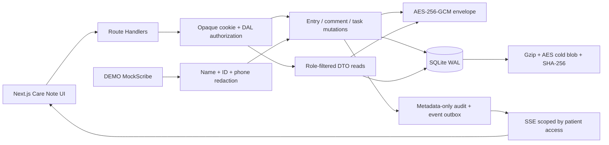
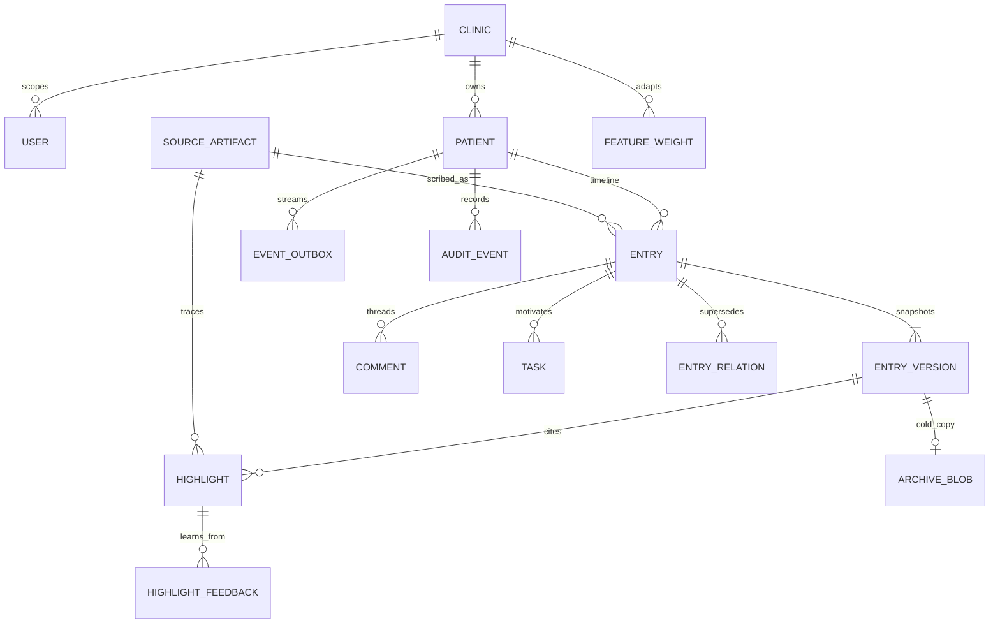

# Nightingale Shared Care Note — Technical Brief

## Product thesis and scope

The core failure is not absence of notes; it is the cost of reconstructing a trustworthy story during a consult. Nightingale therefore treats the “top card” as a decision surface, not an AI summary. It shows no more than five explainable items: critical risk, unresolved work, clinician-confirmed corrections, and meaningful recent change. Each item answers “why now?” and retains an exact source pointer. The longitudinal timeline remains the source of truth.

This implementation prioritizes the required trust loop: synthetic data, role-owned sections, immutable snapshots, deterministic conflict behavior, internal collaboration, distinct AI-scribed entries, source-level provenance, patient-authored updates, reversible feedback, and admin audit review. A local MockScribe proves the provider boundary without an API key or network disclosure. Ambient voice, transcription, diarization, multilingual capture, and real-EHR integration are excluded. The governing assumption is a seeded single-clinic demo; the first-principles rule is that derived summaries never replace immutable evidence.

## Architecture

Next.js 16 keeps UI, API, SSE, and authorization in one TypeScript repository. Prisma provides a typed relational model; its better-sqlite adapter opens one local WAL database with foreign keys and a busy timeout. Route Handlers authenticate an opaque random cookie whose token is stored only as a hash. The data-access layer checks clinic scope or a patient link before querying related content. A missing permission returns 404 when object existence itself would disclose data.

All clinical free text is AES-256-GCM encrypted before persistence. Audit events never receive content. Raw synthetic scribe input is encrypted locally, then names, Singapore IC/ID-like values, and phone numbers are replaced before the provider function is called. MockScribe only sees the redacted string and deterministically emits a typed summary. Production would terminate TLS at a trusted proxy and store encryption keys in a rotating secrets manager.

## Data and trust model

`Entry` holds ownership, role, type, visibility, section, risk, current version, and optional source/supersession IDs. Body text exists only in append-only `EntryVersion` rows. A revert decrypts the selected historical snapshot and appends a new version with `revertedFromVersion`; nothing is deleted. A write atomically increments `currentVersion` only when it still equals `baseVersion`. Different Entries/sections succeed independently; the losing writer to the same Entry receives `409 VERSION_CONFLICT` with server and client versions, and the UI preserves the draft alongside current server text.

Patient responses are constructed from a separate allowlist: only `visibility=patient` instructions and patient-authored insights are returned; highlights, tasks, comments, raw artifacts, and audit fields are absent—not merely hidden. Staff can modify only their own staff entries. Clinicians can modify only their own clinician entries and can read staff/system entries. Admin is clinic-scoped, can review metadata-only audit events, and may reset synthetic data only in development.

A provenance pointer is structural: `entryId`, immutable `versionId`, version number, character offsets, and optional `sourceArtifactId`. Resolution repeats authorization, decrypts hot or cold content, verifies its plaintext SHA-256, and returns the exact slice. Clinician correction is a new Entry with a `supersedes` relation; the original patient/AI statement remains visible and auditable.

## Importance, decay, measurement, and trade-offs

Importance is deterministic and explainable. Base score combines risk (`critical +40`, `high +25`, `medium +10`), unresolved task (`+25`), clinician confirmation (`+15`), recognized entity (`allergy +15`, `medication +10`, chief complaint `+8`), and freshness (up to `+15`). Feedback changes a clinic-scoped `featureKey` weight: accept/pin `+2`, reject `-2`, and `undo_reject +2`, bounded to `[-15,15]`. Matching future/current highlights recompute `finalScore = clamp(base + learned, 0, 100)`. Feedback, weight, and reason are auditable; rejection cannot erase provenance and an accidental rejection can be restored.

Cold-archive eligibility is deliberately conservative: older than 365 days, low risk, no open linked task, no accepted/pinned/high-risk highlight, and no correction/critical type. Preview is default. Apply writes the original encrypted payload into a gzip-compressed, newly AES-encrypted envelope, rereads and hashes the file, then marks the SQL content cold. Metadata and pointers stay hot. Reads verify archive SHA-256, decrypt/decompress, then verify the original plaintext hash. Critical risks, allergies, open work, and corrections are excluded.

Acceptance uses Vitest for primitives plus the five named Python files through the actual HTTP API. Ten cases cover cross-role writes, cross-clinic hiding, patient DTO omission and update persistence, immutable version/revert/audit behavior, exact source spans, two-entry concurrency, deterministic same-entry 409, learned score increase, and reject-undo recovery. `test:encrypted-db` scans SQLite bytes for known plaintext. The production benchmark performs 50 warmups then 200 Care Note requests at concurrency 10 and records machine/data/P50/P95 in `reports/latest-benchmark.json`; the gate is P95 below 300 ms.

SQLite is the right 72-hour delivery choice, not the intended multi-clinic production database. WAL serializes writes, so horizontally scaled deployment would move to PostgreSQL with row-level security and a transactional outbox consumer. The 25-second SSE loop is intentionally simple and reconnectable; production would use a broker. Demo sessions avoid external identity setup but require OIDC/passkeys, CSRF protection, session rotation, rate limits, key rotation, backup/restore drills, and security review before real data.
